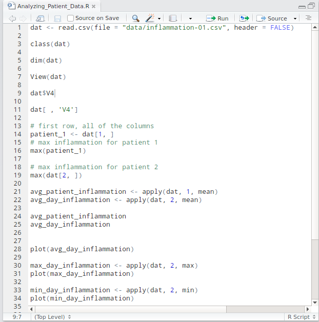
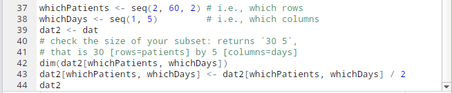

## Analyzing Patient Data

*2019年03月09日 星期六 09时22分18秒*

### Overview
#### Questions

- How do I read data into R?
- How do I assign varirables?
- What is a data frame?
- How do I access subsets of a data frame?
- How do I calculate simple statistic like mean and median?
- where can I get help?
- How can I plot my data?
####  Objectives
- Read tabular data from a file into a program.
- Assign values to variables.
- Select individual values and subsections from data.
- Perform operations on a data frame of data.
- Display simple graphs. 

Have been Given the data, wo want to:
- Load data into memory,
- Calculate the average value of inflammation per day across all patients, and
- Plot the results.
To do all that, we'll have to learn a little bit about programming.

###  Loading Data

*change the working directory.*
>setwd("~/workspace/R/Lesson1")

*read file from directory.*
>read.csv(file = "data/inflammation-01.csv", header = FALSE)

`read.csv`has two arguments: the name of the file we want to read, and whether the first line of the file contains names for the columns of data. ... Assigning the second argument, `header`, to be`FALSE`indicates that the date files does not have column headers.

*create variables...*
>dat <- read.csv(file = "data/inflammation-01.csv", header = FALSE)

### Manipulating Data
Now that our data load into R, we can start doing thins with them.
*first ask what type of thing in variable is:*
>class(dat)
>[1] "data.frame"

The output tells us that it's a data frame. 
*see the shape, or dimensions, of the data frame:*
>dim(dat)
>[1] 60 40

*first value in dat, row 1, column 1*
>dat[1, 1]
>[1] 0

*if we want to select more than one row or column, we can use the function `c()`, which stands for **c**ombine.*
>dat[c(1, 3, 5), c(10, 20)]
    V10 V20
1    3    18
3    9    10
5    4    17

*Operator **:**, This special function generates sequences of numbers*
>1:5
>[1] 1 2 3 4 5

*All columns from row 5*
>dat[5, ]
>  V1 V2 V3 V4 V5 V6 V7 V8 V9 V10 V11 V12 V13 V14 V15 V16 V17 V18 V19 V20
5  0  1  1  3  3  1  3  5  2   4   4   7   6   5   3  10   8  10   6  17
  V21 V22 V23 V24 V25 V26 V27 V28 V29 V30 V31 V32 V33 V34 V35 V36 V37 V38
5   9  14   9   7  13   9  12   6   7   7   9   6   3   2   2   4   2   0
  V39 V40
5   1   1

*Columns can also be addressed by name, with either the $ operator (ie. dat$V16) or square brackets (ie. dat[, 'V16']).*

*first row, all of the columns*
>patient_1 <- dat[1, ]

[1]*max inflammation for patient 1*

>max(patient_1)

[2]*max inflammation for patient 2*
>max(dat[2, ])

[3]*minimum inflammation on day 7*
>min(dat[, 7])

[4]*mean inflammation on day 7*
>mean(dat[, 7])

[5]*median inflammation on day 7*
>median(dat[, 7])

[6]*standard deviation of inflammation on day 7*
>sd(dat[, 7])

For every column in the data frame, the function “summary” calculates: the minimun value, the first quartile, the median, the mean, the third quartile and the max value, giving helpful details about the sample distribution.
[7]*Summarize function*
>summary(dat[, 1:4])

`apply` allows us to repeat a function on all of the `rows (MARGIN = 1)` or `columns (MARGIN = 2)` of a data frame.

*Thus, to obtain the average inflammation of each patient we will need to calculate the mean of all of the rows (MARGIN = 1) of the data frame.*
>avg_patient_inflammation <- apply(dat, 1, mean)

*And to obtain the average inflammation of each day we will need to calculate the mean of all of the columns (MARGIN = 2) of the data frame.*
>avg_day_inflammation <- apply(dat, 2, mean)

#### Subsetting and Re-Assignment[^picture02]
*Let’s pretend there was something wrong with the instrument on the first five days for every second patient (#2, 4, 6, etc.), which resulted in the measurements being twice as large as they should be.*
>whichPatients <- seq(2, 60, 2) # i.e., which rows
>whichDays <- seq(1, 5)         # i.e., which columns
dat2 <- dat

*check the size of your subset: returns `30 5`, that is 30 [rows=patients] by 5 [columns=days]*
>dim(dat2[whichPatients, whichDays])
>dat2[whichPatients, whichDays] <- >dat2[whichPatients, whichDays] / 2
>dat2

#### Using the Apply Function on Patient Data
Please use a combination of the apply function and indexing to:
1. calculate the mean inflammation for patients 1 to 5 over the whole 40 days
2. calculate the mean inflammation for days 1 to 10 (across all patients).
3. calculate the mean inflammation for every second day (across all patients).

*1.*
>apply(dat[1:5, ], 1, mean)

*2.*
>apply(dat[, 1:10], 2, mean)

*3.*
>apply(dat[, seq(1, 40, by = 2)], 2, mean)

### Key Points

- Use `variable <- value` to assign a value to a variable in order to record it in memory.
- Objects are created on demand whenever a value is assigned to them.
- The function `dim` gives the dimensions of a data frame.
- Use `object[x, y]` to select a single element from a data frame.
- Use `from:to` to specify a sequence that includes the indices from `from` to `to`.
- All the indexing and subsetting that works on data frames also works on vectors.
- Use `#` to add comments to programs.
- Use `mean`, `max`, `min` and `sd` to calculate simple statistics.
- Use `apply` to calculate statistics across the rows or columns of a data frame.
- Use `plot` to create simple visualizations.

------

[^picture]: picture01

[^picture]: picture02

